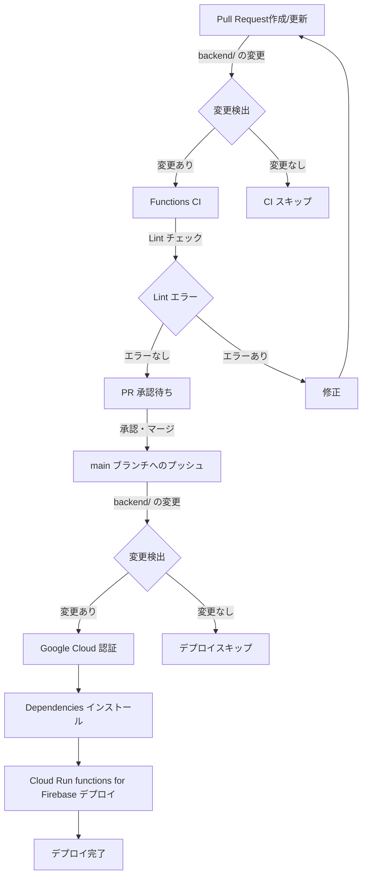

# 【Backend】 flutter_tokyo_hackathon_2024

サーバーサイドプログラム（Cloud Run functions for Firebase）開発用のディレクトリです。

## 対象

- Cloud Run functions for Firebase
  - Genkit でのバトル評価ロジック
  - Genkit でのキャラクター生成ロジック

※ 上記以外の Firebase リソース（Firestore, 各種 Rules, IAM など）は [infrastructure](../infrastructure) フォルダ内の Terraform コードにて管理されています。

## CI/CD パイプライン

[backend-ci.yaml](../.github/workflows/backend-ci.yaml) と [backend-cd.yaml](../.github/workflows/backend-cd.yaml) のワークフローによって、下記の CI/CD パイプラインを実現しています。

### CI プロセス (Pull Request 作成／更新時)
1. Pull Requestが作成または更新されると、`backend/**` パス内の変更を検出します。
2. 変更がある場合、Functions CIジョブが実行されます。
3. 依存関係をインストールし、Lint チェックを行います。
4. Lint エラーがある場合は修正が必要です。

### CD プロセス (main ブランチへのマージ時)
1. `main` ブランチへのプッシュ時に `backend/**` パス内の変更を検出します。
2. 変更がある場合、デプロイジョブが実行されます。
3. Google Cloud (Firebase) への認証を行います。
4. 依存関係をインストールします。
5. Cloud Run functions for Firebase へのデプロイを実行します。

注意: 変更が検出されない場合、それぞれのプロセスはスキップされます。