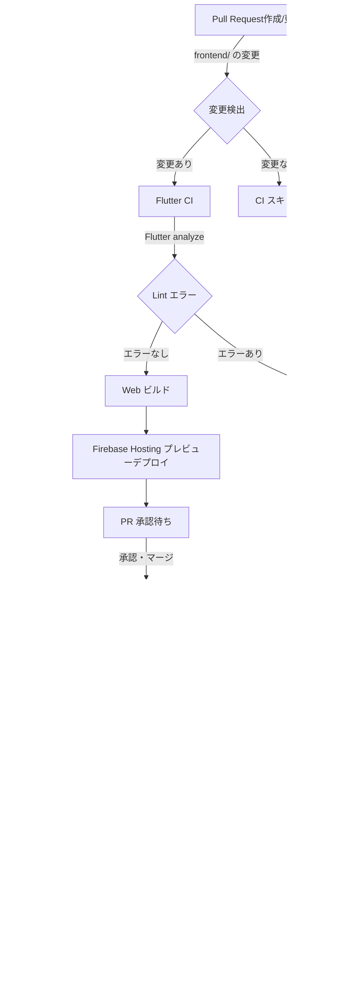

# 【Frontend】 flutter_tokyo_hackathon_2024

フロントエンド（Flutter）プログラム開発用のディレクトリです。

## アプリ名

Generate Wars

## フロントエンドアーキテクチャ

Feature First + Onion Architecture

### 実装ルール

このプロジェクトでは Feature First のアーキテクチャを採用しています。各機能（feature）は独立したディレクトリを持ち、その中に以下の層を含みます。

1. data: データの取得や保存に関する実装を行います。Firebase、APIエンドポイント、データベースとの通信や操作をこの層で行います。

2. model: ビジネスロジックとエンティティを定義します。データモデルやドメインロジックをこの層に配置します。

3. ui: ユーザーインターフェースに関するコードを配置します。Widget や ページ (Page) の実装をこの層で行います。

各機能は独立しており、他の機能に依存せずに開発できるようにします。  
共通のユーティリティや定数は `core` ディレクトリに配置し、必要に応じて各機能から参照します。  
この構造により、機能ごとの開発やテストが容易になり、アプリケーションの拡張性と保守性が向上します。

## CI/CD パイプライン

[frontend-ci.yaml](../.github/workflows/frontend-ci.yaml) と [frontend-cd.yaml](../.github/workflows/frontend-cd.yaml) のワークフローによって、下記の CI/CD パイプラインを実現しています。

### CI プロセス (Pull Request 作成／更新時)
1. Pull Requestが作成または更新されると、`frontend/**` パス内の変更を検出します。
2. 変更がある場合、Flutter CIジョブが実行されます。
3. Flutter SDKをセットアップし、依存関係をインストールします。
4. `flutter analyze` を実行し、Lint チェックを行います。
5. Lint エラーがない場合、Flutter Web ビルドを行います。
6. ビルドが成功すると、Firebase Hosting にプレビューデプロイを行います。

### CD プロセス (main ブランチへのマージ時)
1. `main` ブランチへのプッシュ時に `frontend/**` パス内の変更を検出します。
2. 変更がある場合、デプロイジョブが実行されます。
3. Google Cloud (Firebase) への認証を行います。
4. Flutter SDK をセットアップし、依存関係をインストールします。
5. Flutter Webビルドを行います。
6. Firebase Hosting への本番デプロイを実行します。

注意: 変更が検出されない場合、それぞれのプロセスはスキップされます。