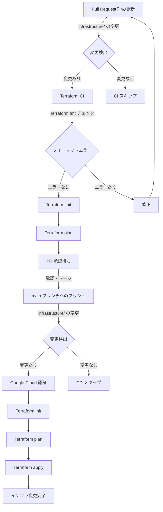

# 【Infrastructure】 flutter_tokyo_hackathon_2024_template

インフラストラクチャ管理用の Terraform ディレクトリです。

## 管理対象のクラウドリソース

- Firestore
  - DB
  - Collection / Document Data
  - Security Rules
  - Indexes
- Cloud Storage for Firebase
  - Bucket
  - Security Rules
- Firebase Authentication
  - Anonymous Authentication

## 管理概要

```plain
.
├── firebase_rules          
│   ├── firestore.rules     # Firestore に対するセキュリティルール定義
│   └── storage.rules       # Cloud Storage for Firebase に対するセキュリティルール定義
├── authentication.tf       # Firebase Authentication 定義
├── backend.tf              # .tfstate 置き場定義
├── firestore.tf            # Firestore DB 定義
├── main.tf                 # Firebase リソース定義
├── provider.tf             # Google Beta プロバイダ定義
├── variables.tf            # 秘匿情報などを GitHub Secret から受け取るための箱の定義
└── storage.tf              # Cloud Storage for Firebase リソース定義
```

## CI/CD パイプライン

[infrastructure-ci.yaml](../.github/workflows/infrastructure-ci.yaml) と [infrastructure-cd.yaml](../.github/workflows/infrastructure-cd.yaml) のワークフローによって、下記の CI/CD パイプラインを実現しています。



### CI プロセス (Pull Request 作成／更新時)
1. Pull Requestが作成または更新されると、`infrastructure/**` パス内の変更を検出します。
2. 変更がある場合、Terraform CIジョブが実行されます。
3. `terraform fmt` を実行し、Terraformコードのフォーマットをチェックします。
4. Terraformの初期化 (`terraform init`) を行います。
5. `terraform plan` を実行し、インフラの変更計画を生成します。
6. 生成された計画はPull Requestのコメントとして表示され、レビューの対象となります。

### CD プロセス (main ブランチへのマージ時)
1. `main` ブランチへのプッシュ時に `infrastructure/**` パス内の変更を検出します。
2. 変更がある場合、Terraform CDジョブが実行されます。
3. Google Cloudへの認証を行います。
4. Terraformの初期化 (`terraform init`) を行います。
5. `terraform plan` を実行し、最終的な変更計画を確認します。
6. `terraform apply` を実行し、実際のインフラ変更を適用します。

注意: 変更が検出されない場合、それぞれのプロセスはスキップされます。
